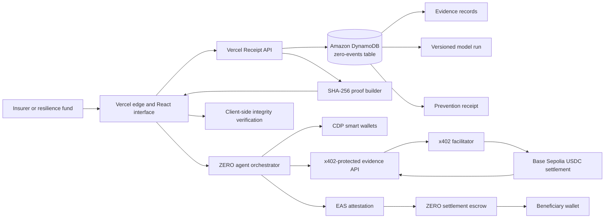

# ZERO architecture

## Deliberate DynamoDB model

ZERO uses a single-table event aggregate. Every read needed to reconstruct and verify a receipt is served by one strongly consistent query.

| PK | SK | Entity | Purpose |
|---|---|---|---|
| `EVENT#<eventId>` | `RECEIPT#<receiptId>` | Receipt | Immutable human and economic outcome |
| `EVENT#<eventId>` | `MODEL#<version>` | Model run | Method, fit, interval, checks, donor count |
| `EVENT#<eventId>` | `EVIDENCE#<sourceId>` | Evidence | Provenance metadata and source hash |
| `EVENT#<eventId>` | `AGENT#<runId>#<step>` | Agent milestone | Wallet, x402, approval, attestation, and settlement trace |

This access pattern scales horizontally by event, avoids joins during verification, and preserves the exact model and evidence used for each issued receipt.

## Agent and settlement boundary

Agents collect evidence, propose verification, and request settlement; they do not override contract policy. The escrow independently checks the EAS schema, verifier role, receipt hash, beneficiary, token, amount, expiration, revocation, and replay status before transferring funds. CDP creates named agent wallets when configured; local and CI runs use deterministic public addresses without private keys.

The procurement agent requests a protected observation and receives HTTP `402`. Its CDP EOA signs the x402/EIP-3009 authorization, the facilitator verifies and settles Base Sepolia USDC to the evidence-provider EOA, and only then does the endpoint return the observation. ZERO hashes that purchased evidence into the persisted agent trace.

The model provider is optional and cannot decide financial facts. `AI_BASE_URL`, `AI_API_KEY`, and `AI_MODEL` support OpenAI-compatible providers such as DeepSeek or Groq. Without a key, the same workflow remains functional using deterministic narratives.

## Production path

1. DynamoDB table `zero-events` is provisioned in `us-east-2` with on-demand billing, server-side encryption, project tags, and point-in-time recovery.
2. Enable recovery with `aws dynamodb update-continuous-backups --table-name zero-events --point-in-time-recovery-specification PointInTimeRecoveryEnabled=true`.
3. Vercel production assumes the read-only `zero-vercel-production` role through a project- and environment-scoped OIDC trust policy. Set `AWS_ROLE_ARN`, `ZERO_TABLE_NAME`, `ZERO_DEMO_EVENT_ID`, and `AWS_REGION` in the deployment; no long-lived AWS keys are required.
4. Run `npm run seed:dynamodb` once with the same AWS environment.
5. Deploy to Vercel. The interface changes its provenance label from `DEMO LEDGER` to `DYNAMODB LIVE` only when the API returns a reconstructed receipt.
6. Configure CDP and AI variables, grant DynamoDB milestone-write permissions, register the EAS schema, and deploy the token and escrow to Base Sepolia.

## Provisioned proof

- Region: `us-east-2`
- Table: `zero-events`
- Records: 6
- Recovery: enabled
- Production: [zero-plum-eta.vercel.app](https://zero-plum-eta.vercel.app)
- AWS access: short-lived Vercel OIDC credentials; DynamoDB query/get/describe only
- Devpost-safe screenshot: [`docs/aws-dynamodb-proof-redacted.png`](./docs/aws-dynamodb-proof-redacted.png)
