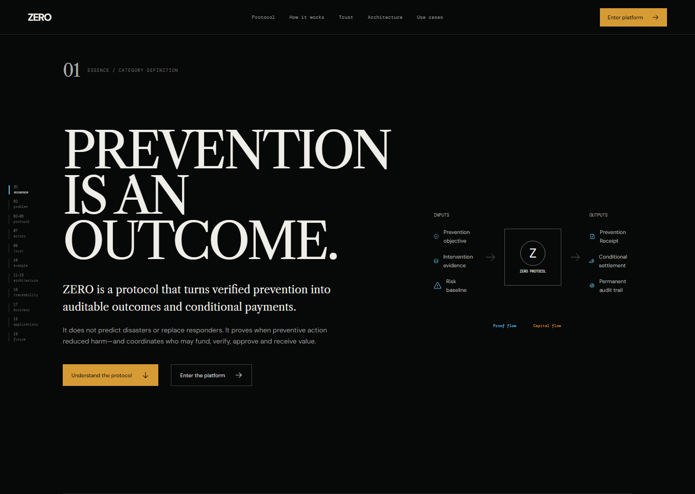
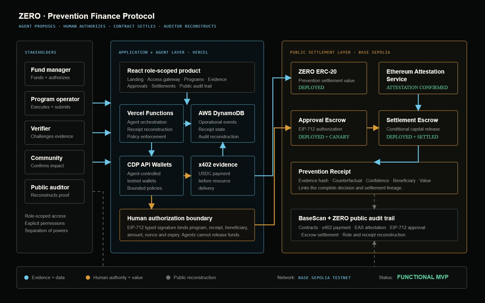
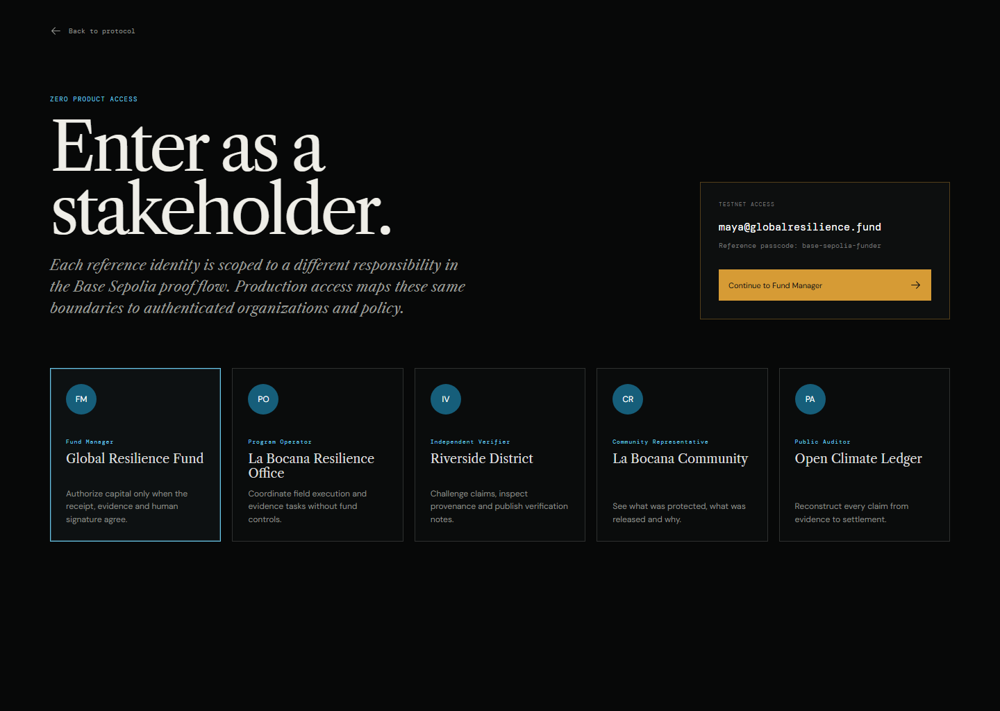
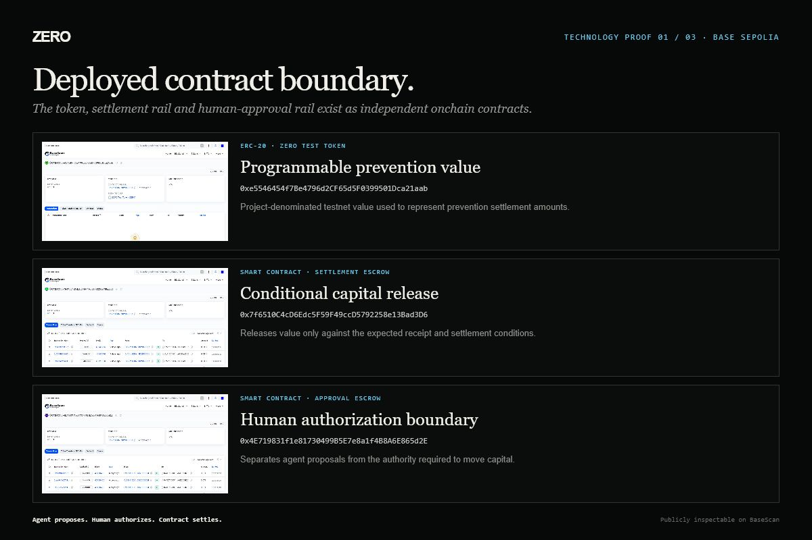
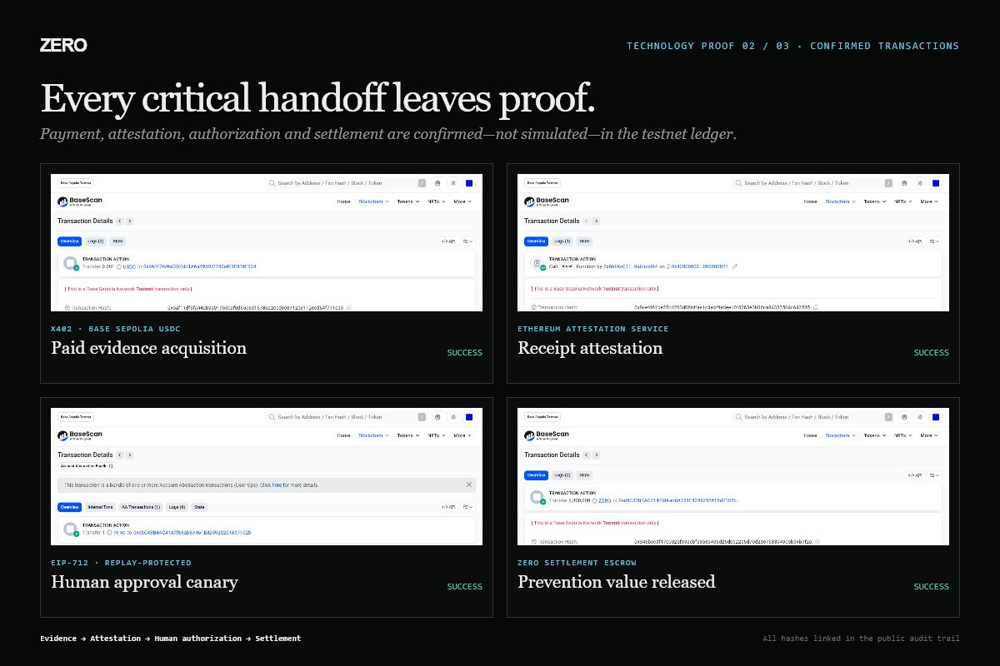
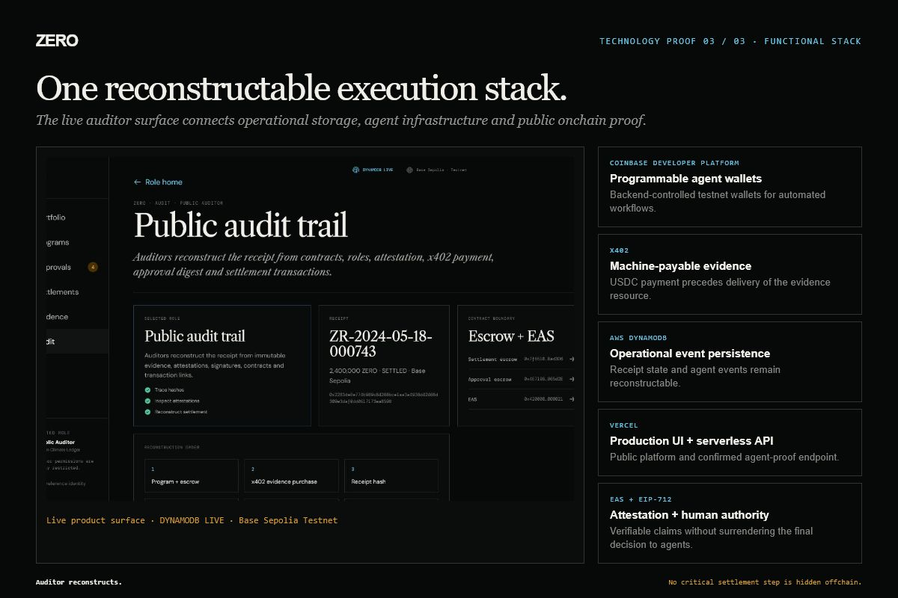

# Financing the Disaster That Never Happened

## How we built ZERO, a prevention-finance protocol that turns verified prevention into a fundable, auditable and payable outcome

> 📷 **COVER IMAGE — INSERT BEFORE PUBLISHING**  
> Upload the custom 3:2 ZERO Devpost thumbnail.  
> Caption: **ZERO — Prevention is an outcome.**  
> Delete this marker after uploading the image.

> This project and this article were created for the purpose of entering the H0 Hackathon. **#H0Hackathon**

Our world knows how to pay after a tragedy. It still does not know how to fund one that never happens.

When a community floods, a disease spreads or critical infrastructure fails, money moves. Governments declare emergencies. Insurers calculate losses. Humanitarian organizations mobilize. News coverage makes the damage visible, and that visibility creates a financial response.

Prevention has the opposite problem.

When an early-warning system works, a shelter is completed in time or a disease is contained before it spreads, the defining image is an absence: no destroyed homes, no overflowing hospital and no public catastrophe. Prevention's greatest success—that nothing happened—is also what makes its value difficult to prove.

That paradox became the starting point for ZERO.

ZERO is a prevention-finance protocol. It transforms evidence, counterfactual analysis, independent verification, human authorization and blockchain settlement into a new artifact: a **Prevention Receipt**.

The goal is not to reward vague claims that something bad might have happened. The goal is to create a disciplined, reconstructable process through which prevention can become economically legible without pretending uncertainty has disappeared.

> 📷 **IMAGE 1 — INSERT HERE**  
> File: `docs/final/01-landing-hero.png`  
> Caption: **ZERO reframes prevention as a verifiable and financeable outcome.**  
> Delete this marker after uploading the image.

## The missing financial primitive

Most financial systems recognize visible outcomes. A damaged asset can be appraised. A medical treatment can be billed. A delivered product can be counted. A catastrophe can be assigned an insured loss.

Prevented harm is harder.

Suppose a flood-resilience program installs sensors, trains a community response network and enables evacuation before dangerous water levels arrive. We can observe the intervention. We can inspect the sensor data. We can verify that people moved to safety. But the central claim—how much harm was prevented—depends on a counterfactual: what would likely have happened without the intervention?

That is not a problem blockchain solves by itself. It is not a problem an AI model should be allowed to answer unilaterally. It is a problem of evidence, uncertainty, governance, incentives and accountability.

ZERO treats prevention as a protocol problem.

Before a program begins, participants define:

- the prevention objective;
- the intervention and measurable milestones;
- the required evidence;
- the beneficiary;
- the counterfactual method;
- acceptable confidence and verification conditions;
- the amount of committed capital;
- the human authority required before settlement.

After execution, ZERO connects what was promised to what can be demonstrated. The result is not a perfect claim about an alternate universe. It is a transparent receipt showing the evidence used, the uncertainty retained, the people responsible for each decision and the exact conditions under which value moved.

## The Prevention Receipt

A Prevention Receipt is the core primitive of ZERO.

It links:

1. **Program identity** — the intervention, location, participants and agreed rules.
2. **Observed outcome** — what can be directly supported by field evidence.
3. **Counterfactual estimate** — the expected outcome without the intervention.
4. **Confidence** — an explicit measure of uncertainty, not a declaration of certainty.
5. **Evidence lineage** — sources, timestamps, hashes, payments and attestations.
6. **Verification** — the independent assessment and any challenges raised.
7. **Human authorization** — the accountable decision to permit settlement.
8. **Settlement** — the beneficiary, amount, contract and transaction.

This changes the unit of finance. Instead of waiting to price damage after the fact, capital can be conditioned on a verified prevention outcome.

> 📷 **IMAGE 2 — INSERT HERE**  
> File: `docs/final/02-section-8-proof-capital-flow.png`  
> Caption: **ZERO separates the proof flow from the capital flow, connecting both through a Prevention Receipt.**  
> Delete this marker after uploading the image.

## Two coordinated flows

ZERO separates two processes that are often collapsed into one.

### The proof flow

The proof flow moves from intervention to evidence, analysis, verification, authorization and receipt issuance.

Evidence may include sensor observations, operational records, field reports, community confirmations and third-party data. Specialized agents can retrieve, normalize and compare this information. They can flag inconsistencies, calculate confidence and prepare an authorization packet.

But an agent's recommendation is not settlement authority.

### The capital flow

The capital flow begins with committed funds and predefined conditions. Capital remains bounded by contract rules. It can move only when the receipt, beneficiary, amount, nonce, expiration and human authorization match what the settlement contract expects.

This separation is fundamental. Evidence production should not control money. Verification should not represent the beneficiary. Agents should not approve their own conclusions. Auditors should be able to reconstruct the result without possessing execution privileges.

Our architecture can be summarized in four sentences:

> **Agent proposes. Human authorizes. Contract settles. Auditor reconstructs.**

> 📷 **IMAGE 3 — INSERT HERE**  
> File: `docs/submission/zero-architecture.png`  
> Caption: **ZERO’s architecture preserves separation between evidence, human authority, settlement and public audit.**  
> Delete this marker after uploading the image.

## Why agents—and why bounded agents

Prevention programs generate fragmented information. A field operator may submit evidence in one format, a sensor provider in another and a verifier in a third. The work required to organize this information is slow, repetitive and expensive.

Agents are useful because they can coordinate these handoffs:

- create or use programmatically controlled wallets;
- acquire machine-readable evidence;
- normalize evidence into a shared schema;
- compare observations with program conditions;
- prepare a Prevention Receipt;
- request independent verification;
- assemble a human-readable authorization packet;
- reconstruct the audit trail.

The dangerous version of this architecture would give an agent custody, judgment and settlement authority simultaneously.

ZERO deliberately refuses that design.

Agents operate inside explicit boundaries. A human approver signs an EIP-712 typed message bound to the exact program, receipt hash, beneficiary, amount, nonce and expiry. The contract—not the agent—enforces the final settlement conditions.

AI is therefore not presented as an oracle that knows the future. It is a coordination and analysis layer whose work remains inspectable and contestable.

## Five stakeholders, five different products

Our first interface looked convincing as a demonstration but not as a real product. Every capability was visible from the same place. That would be unacceptable in a system handling evidence, community claims and capital.

We redesigned ZERO around separation of powers.

### Fund Manager

The fund manager sees risk, evidence integrity, reserved capital and pending authorizations. This role can authorize a conditional release but cannot alter field evidence or verification scores.

### Program Operator

The operator coordinates milestones, readiness and evidence submission. This role cannot release funds or verify its own outcome.

### Independent Verifier

The verifier inspects provenance, challenges confidence and publishes verification notes. This role cannot move capital or modify program execution.

### Community Representative

The community sees what was promised, what was protected, what evidence supports the claim and what value was released. Transparency does not become administrative control.

### Public Auditor

The auditor can trace hashes, inspect attestations and reconstruct settlement. The role is intentionally read-only.

> 📷 **IMAGE 4 — INSERT HERE**  
> File: `docs/final/03-stakeholder-access.png`  
> Caption: **Every stakeholder enters through a role-scoped identity with explicit permissions.**  
> Delete this marker after uploading the image.

This role separation turned ZERO from a beautiful dashboard into the beginning of an accountable product.

## A functional testnet implementation

For the hackathon, we did not want blockchain to be decorative. We implemented a testnet proof chain on Base Sepolia.

The deployed boundary includes:

- a ZERO ERC-20 test token representing project-denominated prevention value;
- a settlement escrow contract;
- a separate approval escrow contract;
- Ethereum Attestation Service integration;
- EIP-712 typed human authorization;
- confirmed settlement and authorization-canary transactions.

We also implemented a confirmed x402 payment in Base Sepolia USDC. In this flow, an agent-controlled procurement wallet pays an evidence provider before the evidence resource is returned. This demonstrates how machine-payable data can become part of a verifiable prevention pipeline.

Coinbase Developer Platform provides the programmable wallet infrastructure. Vercel hosts the production interface and serverless API. AWS DynamoDB stores operational events and receipt state so the process can be reconstructed outside the blockchain as well as through it.

The blockchain is used for the commitments that benefit from public immutability: contracts, payments, attestations, authorization and settlement. Operational application data remains in the appropriate cloud layer.

> 📷 **IMAGE 5 — INSERT HERE**  
> File: `docs/final/13-proof-deployed-contracts.png`  
> Caption: **ZERO token, settlement escrow and approval escrow deployed independently on Base Sepolia.**  
> Delete this marker after uploading the image.

> 📷 **IMAGE 6 — INSERT HERE**  
> File: `docs/final/14-proof-onchain-transactions.png`  
> Caption: **Confirmed x402 payment, EAS attestation, EIP-712 authorization canary and escrow settlement.**  
> Delete this marker after uploading the image.

## The La Bocana reference program

Our reference flow follows a flood early-warning intervention in La Bocana, Colombia.

In the product, the Prevention Receipt reports:

- 37 people protected;
- 127 verified evidence points;
- 94% counterfactual confidence;
- 2.4 million ZERO released;
- linked x402 evidence payment;
- EAS attestation;
- EIP-712 human approval;
- Base Sepolia escrow settlement.

These numbers form a reference testnet scenario, not a claim that the protocol has completed a real-world humanitarian deployment. The purpose is to demonstrate the entire accountability chain with working infrastructure.

That distinction matters. A serious prevention protocol must never confuse a technical demonstration with validated real-world impact.

## What was hardest

### Representing something that did not happen

The deepest challenge was conceptual. A prevention claim can become irresponsible if it hides assumptions or turns uncertainty into marketing. We chose to expose the counterfactual, evidence lineage and confidence rather than compress everything into a single unquestionable score.

### Giving agents enough power—but not too much

Agents need enough autonomy to coordinate evidence and payments. They should not have the authority to approve their own analysis and release funds. Designing that boundary shaped the wallet, signature and contract architecture.

### Making every technology necessary

It is easy to add AI and blockchain to a hackathon project as decoration. We required each component to answer a concrete question:

- **Agents:** Who coordinates fragmented work?
- **CDP wallets:** How can software participate in bounded economic actions?
- **x402:** How can an agent pay for evidence before receiving it?
- **DynamoDB:** Where does operational state persist and reconstruct?
- **EAS:** How are claims attested?
- **EIP-712:** How is human intent bound to exact settlement terms?
- **Smart contracts:** What prevents unauthorized capital movement?
- **BaseScan and the audit interface:** How does an outsider verify the chain?

### Designing for stakeholders instead of features

The role redesign was one of the most important lessons. Real products are not collections of available capabilities. They are carefully bounded experiences for people with different responsibilities and risks.

## How ZERO can become a business

ZERO is designed as B2B infrastructure for organizations that already finance risk, resilience and public outcomes.

Potential customers include:

- insurers and reinsurers;
- climate-resilience funds;
- development banks;
- humanitarian organizations;
- governments and municipalities;
- corporations managing supply-chain or infrastructure risk;
- foundations financing measurable prevention.

A commercial model could combine:

1. **Protocol and settlement fees** on verified capital releases.
2. **Enterprise subscriptions** for program management, governance and audit tooling.
3. **Verification services** and configurable evidence standards.
4. **Data and risk infrastructure APIs** for insurers, funds and public agencies.
5. **Private deployments** for regulated or sensitive environments.

The immediate wedge is not “all prevention everywhere.” It is a focused program where evidence already exists, the payer has a clear economic incentive and the counterfactual can be evaluated responsibly.

## Where this could go

The long-term opportunity extends beyond flood resilience.

ZERO could support:

- early disease containment;
- wildfire mitigation;
- heat-wave response;
- drought preparedness;
- preventive maintenance for critical infrastructure;
- cybersecurity incident prevention;
- supply-chain disruption avoidance;
- maternal and community health interventions.

Each domain would require its own evidence standards, verification rules and governance. ZERO should not erase those differences. Its role is to provide a shared coordination, authorization, settlement and audit layer.

The roadmap includes privacy-preserving community data, configurable verifier networks, dispute resolution, production stablecoin settlement, institutional identity, richer counterfactual models and real-world pilots.

> 📷 **IMAGE 7 — OPTIONAL INSERT HERE**  
> File: `docs/final/15-proof-functional-stack.png`  
> Caption: **One reconstructable execution stack across CDP wallets, x402, DynamoDB, Vercel, EAS and EIP-712.**  
> Delete this marker after uploading the image, or delete the entire block if you omit this optional image.

## What we learned

Prevention finance is not simply a prediction problem. It is a coordination and accountability problem.

AI becomes more useful when its authority is constrained. Blockchain becomes more useful when it records meaningful commitments. Human oversight becomes more credible when it is bound to exact data and cannot be silently rewritten later.

Most importantly, uncertainty does not make prevention impossible to finance. It means the uncertainty must become part of the product.

ZERO is our attempt to make prevented harm visible without pretending it is simple.

Our world already has sophisticated systems for measuring loss after tragedy. We believe it can build equally serious systems for recognizing the people, evidence and capital that stop tragedy before it begins.

**Prevention is not the absence of an outcome. Prevention is an outcome.**

---

### Explore ZERO

- Live protocol and application: https://zero-plum-eta.vercel.app
- Stakeholder access: https://zero-plum-eta.vercel.app/enter
- Source code: https://github.com/jhontejada95/ZERO

This project and this article were created for the purpose of entering the H0 Hackathon. **#H0Hackathon #AI #Blockchain #ClimateTech #FinTech #PublicGoods**
